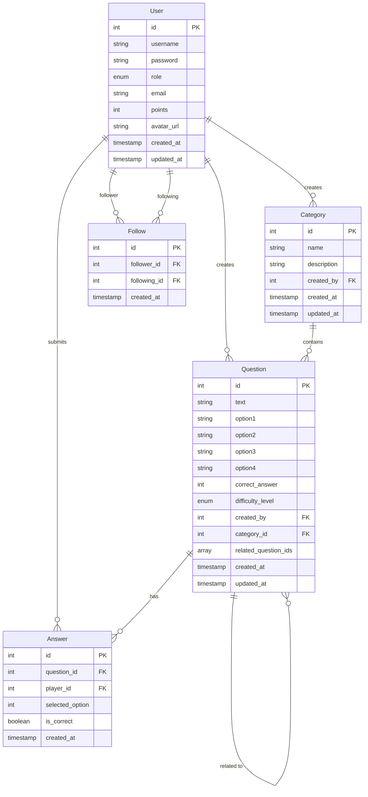

# SoalPich

A robust Spring Boot-based quiz platform that allows users to create, manage, and participate in quizzes across various categories.

## Features

- **User Management**

  - Registration and Authentication
  - JWT-based authorization
  - User profiles with points system
  - Follow/Unfollow functionality
  - Leaderboard system

- **Quiz Features**

  - Create and manage questions
  - Multiple difficulty levels (Easy, Medium, Hard)
  - Category-based organization
  - Multiple choice questions (4 options)
  - Points system based on difficulty
  - Question history tracking

- **Category Management**
  - Create and manage categories
  - Category-based question filtering
  - Question count tracking per category

## Technology Stack

- **Backend**: Spring Boot 3.2.1
- **Database**: MySQL
- **Security**: JWT (JSON Web Tokens)
- **Build Tool**: Maven
- **Java Version**: 17

## Prerequisites

- JDK 17 or higher
- MySQL 8.0 or higher
- Maven 3.x
- Node.js (for frontend)

## Setup and Installation

1. **Clone the Repository**

```bash
git clone https://github.com/mirshaf/Web-Programming-Project
cd question-platform
```

2. **Database Setup**

```sql
mysql -u root -p
```

Then run:

```sql
CREATE DATABASE soalpich;
```

3. **Configure Application Properties**

Update `src/main/resources/application.properties`:

```properties
spring.datasource.url=jdbc:mysql://localhost:3306/quizplatform
spring.datasource.username=your_username
spring.datasource.password=your_password
```

4. **Build and Run**

```bash
./mvnw clean install
./mvnw spring-boot:run
```

## API Endpoints

### Authentication

- `POST /api/auth/register` - Register new user
- `POST /api/auth/login` - Login user

### Questions

- `GET /api/questions` - Get all questions
- `GET /api/questions/{id}` - Get specific question
- `GET /api/questions/random` - Get random question
- `POST /api/questions` - Create new question
- `PUT /api/questions/{id}` - Update question
- `DELETE /api/questions/{id}` - Delete question
- `GET /api/questions/answered` - Get user's answered questions
- `GET /api/questions/my` - Get user's created questions

### Categories

- `GET /api/categories` - Get all categories
- `POST /api/categories` - Create new category
- `PUT /api/categories/{id}` - Update category
- `DELETE /api/categories/{id}` - Delete category
- `GET /api/categories/my` - Get user's categories

### Other Features

- `GET /api/dashboard` - Get user dashboard
- `GET /api/leaderboard` - Get user rankings
- `POST /api/answers` - Submit answer to question

## Security

The application uses JWT for authentication. Include the JWT token in the Authorization header for protected endpoints:

```
Authorization: Bearer <jwt_token>
```

## CORS Configuration

The application is configured to accept requests from `http://localhost:3000` by default. To modify CORS settings, update the `WebConfig.java` file.

## Contributing

1. Fork the repository
2. Create your feature branch (`git checkout -b feature/AmazingFeature`)
3. Commit your changes (`git commit -m 'Add some AmazingFeature'`)
4. Push to the branch (`git push origin feature/AmazingFeature`)
5. Open a Pull Request

## Acknowledgments

- Spring Boot team for the excellent framework
- The open-source community for various dependencies used in this project

## Database Schema


